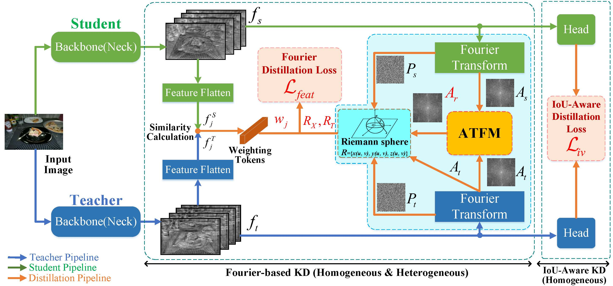
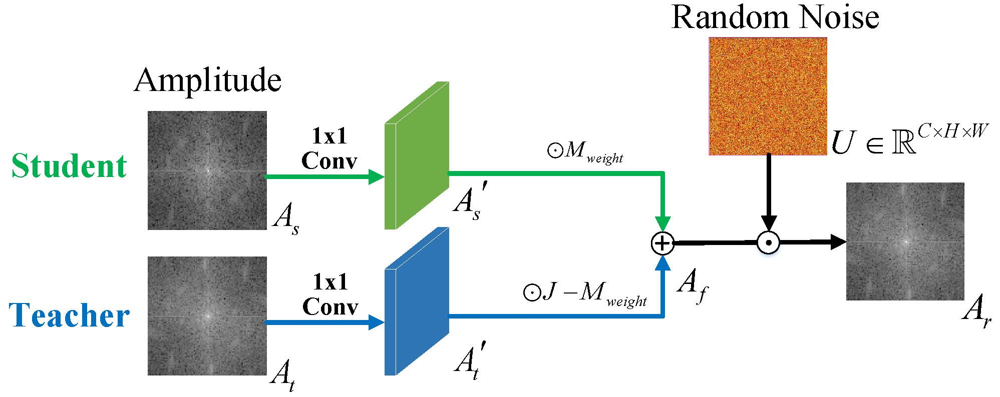

## [Knowledge Distillation in Fourier Frequency Domain for Dense Prediction](https://ieeexplore.ieee.org/document/10792928)


### Introduction

This repository is the official implementation of: Knowledge Distillation in Fourier Frequency Domain for Dense Prediction.

[√]Publish configs and framework codes(based on MMRazor1.0.0)

[√]Publish core codes


### Installation

1.Install MMRazor v1.0.0 (reference: [this](https://mmrazor.readthedocs.io/en/latest/get_started/installation.html).)

2.Install MMEngine(reference: [this](https://mmengine.readthedocs.io/en/latest/get_started/installation.html).)

3.Install MMDetection3.x (if you want to use KD on detection task, reference: [this](https://mmdetection.readthedocs.io/en/latest/get_started.html).)

4.Install MMSegmentationv1.0.0 (if you want to use KD on segmentation task, reference: [this](https://mmsegmentation.readthedocs.io/en/latest/get_started.html).)

Please install them from source e.g.:

```
git clone https://github.com/open-mmlab/mmdetection.git
cd mmdetection
pip install -v -e .
# "-v" means verbose, or more output
# "-e" means installing a project in editable mode,
# thus any local modifications made to the code will take effect without reinstallation.
```


### Train

```
python tools/train.py ${CONFIG_FILE} [optional arguments]
```

e.g.:

For Single GPU

```
python tools/train.py configs/distill/mmdet/fourier/fourier_fpn_reppoints_x101_reppoints_r50_2x_coco_fourier_vfl.py
```

For Multi GPUs

```
python -m torch.distributed.launch --nproc_per_node=4 tools/train.py configs/distill/mmdet/fourier/fourier_fpn_reppoints_x101_reppoints_r50_2x_coco_fourier_vfl.py --launcher pytorch
```

### Architectures

<p align='center'>

</p>

<p align='center'>

</p>


### Results
Object Detection:

| **Teacher**          | **Student**           | **Baseline(mAP)** | **FourierKD(mAP)** |
|:--------------------:|:---------------------:|:-----------------:|:------------------:|
| RepPoints-ResNeXt101 | RepPoints-ResNet50    | 38.6%             | 42.8%              |
| FasterRCNN-ResNet101 | FasterRCNN-ResNet50   | 38.4%             | 40.9%              |
| RepPoints-ResNet50   | RetinaNet-ResNet18    | 31.7%             | 35.2%              |
| RepPoints-ResNet50   | RetinaNet-MobileNetV2 | 28.5%             | 33.3%              |

Semantic Segmentation:

|   **Teacher**    |    **Student**     | **Baseline(mIoU)** | **FourierKD(mIoU)** |
|:----------------:|:------------------:|:------------------:|:-------------------:|
| PspNet-ResNet101 |  PspNet-ResNet18   |       69.85%       |       74.86%        |
| PspNet-ResNet101 | DeeplabV3-ResNet18 |       73.20%       |       77.17%        | |


### Convert KD ckpt to student-only ckpt

If you want to use the trained checkpoint to isolate the parameters of the teacher network to further deploy the student network on edge devices, you can:

```
python tools/model_converters/convert_kd_ckpt_to_student.py ${checkpoint} --out-path ${out-path}
```

### License
This project is released under the [Apache 2.0 license.](./LICENSE)

### Cite
```
@ARTICLE{10792928,
  author={Shi, Min and Zheng, Chengkun and Yi, Qingming and Weng, Jian and Luo, Aiwen},
  journal={IEEE Signal Processing Letters}, 
  title={Knowledge Distillation in Fourier Frequency Domain for Dense Prediction}, 
  year={2024},
  volume={},
  number={},
  pages={1-5},
  keywords={Knowledge distillation;Fourier transform;dense prediction;object detection;semantic segmentation},
  doi={10.1109/LSP.2024.3515795}}
```

